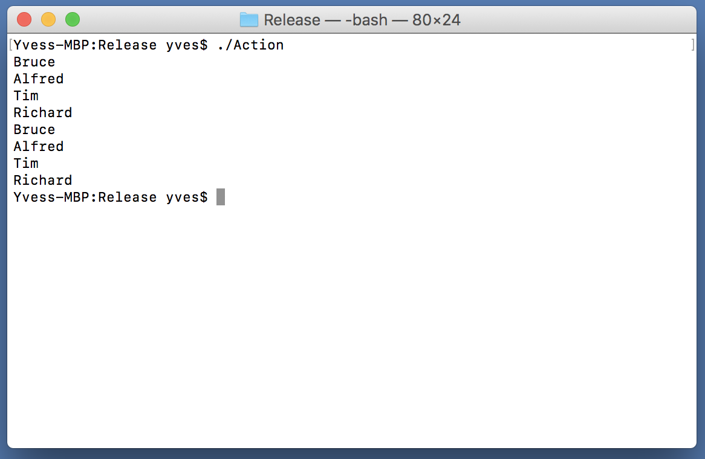
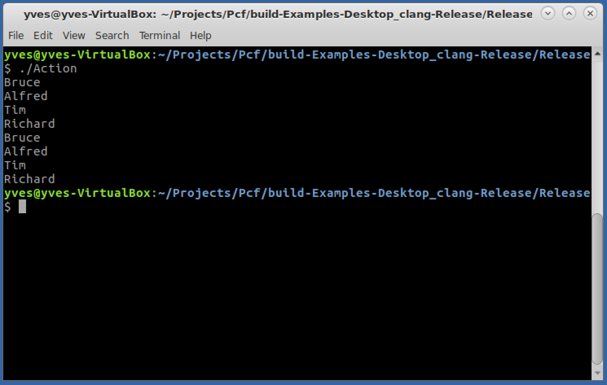
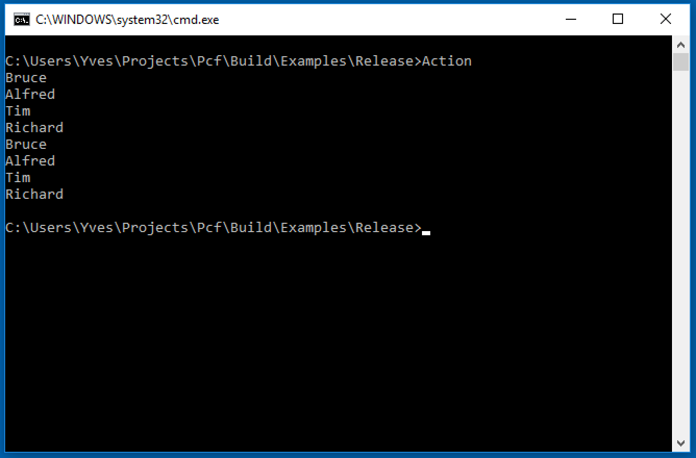

# Action
This example demonstrates the use of the Action<T> delegate to print the contents of a List<T> object. In this example, the Print method is used to display the contents of the list to the console. In addition, the C++ example also demonstrates the use of anonymous methods to display the contents to the console. Note that the example does not explicitly declare an Action<T> variable. Instead, it passes a reference to a method that takes a single parameter and that does not return a value to the List<T>.ForEach method, whose single parameter is an Action<T> delegate. Similarly, in the C++ example, an Action<T> delegate is not explicitly instantiated because the signature of the anonymous method matches the signature of the Action<T> delegate that is expected by the List<T>.ForEach method.

Mac Os X

Ubuntu

Windows

