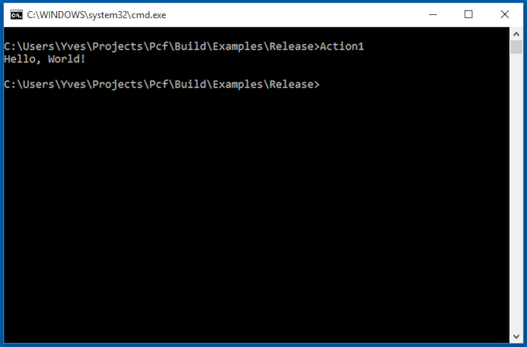
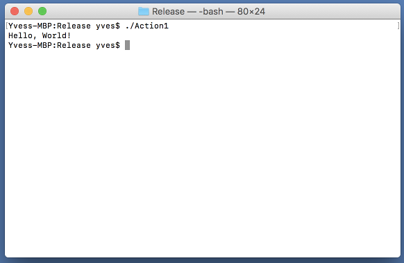
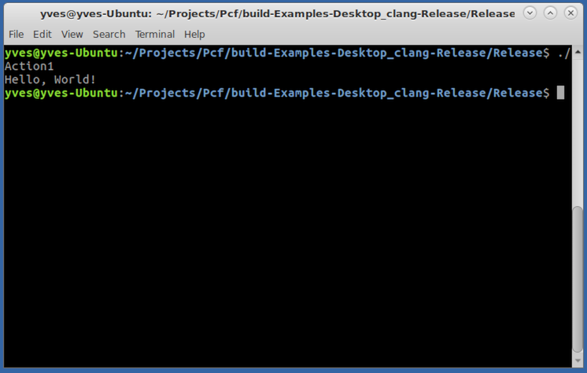

# Action1
This example simplifies this code by instantiating the Action<T> delegate instead of explicitly defining a new delegate and assigning a named method to it.

If Action1 is called without param
## Output
```
Hello, World!
```

If Action1 is called with any param
## Result
<BR>


<p align="left">Windows</p>
<BR>


<p align="left">macOS</p>
<BR>


<p align="left">Ubuntu</p>
<BR>
