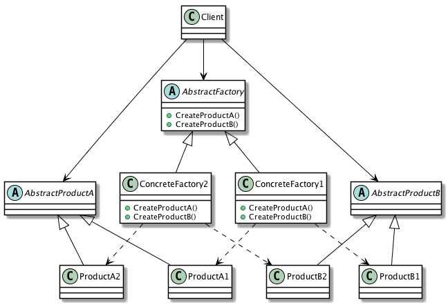

| [Home](Home.md) | [Gallery](Gallery.md) | [Examples](Examples.md) | [Downloads](Downloads.md) | [Documentation](Documentation.md) | [Project](https://sourceforge.net/projects/switchpro) | [Source](https://github.com/gammasoft71/switch) | [License](License.md) | [Contact](Contact.md) | [Gammasoft](https://gammasoft71.wixsite.com/gammasoft) |
|-----------------|-----------------------|-------------------------|-------------------------|-----------------------------------|-------------------------------------------------------|-------------------------------------------------|-----------------------|-----------------------|---------------------------------------------------------|

# Definition

Provide an interface for creating families of related or dependent objects without specifying their concrete classes.

Usage          High

# UML class diagram



# Sample code

This structural code demonstrates the Abstract Factory pattern creating parallel hierarchies of objects. Object creation has been abstracted and there is no need for hard-coded class names in the client code.

```c++
// Abstract Factory pattern -- Creational example
 
#include <Switch/Switch>
 
using namespace System;
 
namespace DesignPatterns {
  namespace Creational {
    // The 'AbstractProductA' abstract class
    class AbstractProductA abstract_ {
    public:
      ~AbstractProductA() = 0;
    };
​
    inline AbstractProductA::~AbstractProductA() {}
​
    // The 'AbstractProductB' abstract class
    class AbstractProductB abstract_ {
    public:
      virtual void Interact(const AbstractProductA& a) const = 0;
    };
 
    // The 'AbstractFactory' abstract class
    class AbstractFactory abstract_ {
    public:
      virtual refptr<AbstractProductA> CreateProductA() const = 0;
      virtual refptr<AbstractProductB> CreateProductB() const = 0;
    };
 
    // The 'ProductA1' class
    class ProductA1 : public AbstractProductA {
    };
 
    // The 'ProductB1' class
    class ProductB1 : public AbstractProductB {
    public:
      void Interact(const AbstractProductA& a) const override {Console::WriteLine(string::Format("{0} interacts with {1}", this->GetType().Name, a.GetType().Name));}
    };
​
    // The 'ProductA2' class
    class ProductA2 : public AbstractProductA {
    };
 
    // The 'ProductB2' class
    class ProductB2 : public AbstractProductB {
    public:
      void Interact(const AbstractProductA& a) const override {Console::WriteLine(string::Format("{0} interacts with {1}", this->GetType().Name, a.GetType().Name));}
    };
 
    // The 'ConcreteFactory1' class
    class ConcreteFactory1 : public AbstractFactory {
    public:
      refptr<AbstractProductA> CreateProductA() const override {return ref_new<ProductA1>();}
      refptr<AbstractProductB> CreateProductB() const override {return ref_new<ProductB1>();}
    };
 
    // The 'ConcreteFactory2' class
    class ConcreteFactory2 : public AbstractFactory {
    public:
      refptr<AbstractProductA> CreateProductA() const override {return ref_new<ProductA2>();}
      refptr<AbstractProductB> CreateProductB() const override {return ref_new<ProductB2>();}
    };
 
    // The 'Client' class. Interaction environment for the products.
    class Client : public object {
    public:
      // Constructor
      Client(const AbstractFactory& factory) {
        this->abstractProductB = factory.CreateProductB();
        this->abstractProductA = factory.CreateProductA();
      }
 
      void Run() {this->abstractProductB->Interact(*this->abstractProductA);}
 
    private:
      refptr<AbstractProductA> abstractProductA;
      refptr<AbstractProductB> abstractProductB;
    };
 
    // MainApp startup class for Creational
    // Abstract Factory Design Pattern.
    class MainApp {
    public:
      // The main entry point for the application.
      static void Main() {
        // Abstract factory #1
        refptr<AbstractFactory> factory1 = ref_new<ConcreteFactory1>();
        Client client1(*factory1);
        client1.Run();
​
        // Abstract factory #2
        refptr<AbstractFactory> factory2 = ref_new<ConcreteFactory2>();
        Client client2(*factory2);
        client2.Run();
      }
    };
  }
}
 
// Specify the Main entry point to System
startup_(DesignPatterns::Creational::MainApp);
```

# Output

```
ProductB1 interacts with ProductA1
ProductB2 interacts with ProductA2​
```

# See also
​
Other Resources

* [Framework Design Guidelines](FrameworkDesignGuidelines.md)
* [Common Design Patterns](CommonDesignPatterns.md)

______________________________________________________________________________________________

© 2010 - 2018 by Gammasoft.
