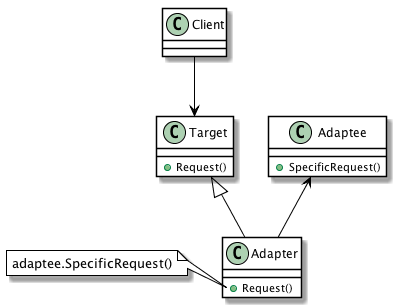

| [Home](Home.md) | [Gallery](Gallery.md) | [Examples](Examples.md) | [Downloads](Downloads.md) | [Documentation](Documentation.md) | [Project](https://sourceforge.net/projects/switchpro) | [Source](https://github.com/gammasoft71/switch) | [License](License.md) | [Gammasoft](https://gammasoft71.wixsite.com/gammasoft) |
|-----------------|-----------------------|-------------------------|-------------------------|-----------------------------------|-------------------------------------------------------|-------------------------------------------------|-----------------------|-----------------------|---------------------------------------------------------|

# Definition

Convert the interface of a class into another interface clients expect. Adapter lets classes work together that couldn't otherwise because of incompatible interfaces.

Usage          Medium high

# UML class diagram



# Sample code

This structural code demonstrates the Adapter pattern which maps the interface of one class onto another so that they can work together. These incompatible classes may come from different libraries or frameworks.

```c++
// Adapter pattern -- Structural example
 
#include <Switch/Switch>
 
using namespace System;
 
namespace DesignPatterns {
  namespace Structural {
    // The 'Target' class
    class Target : public object {
    public:
      virtual void Request() const {
        Console::WriteLine("Called Target Request()");
      }
    };
    
    // The 'Adaptee' class
    class Adaptee : public object {
    public:
      void SpecificRequest() const {
        Console::WriteLine("Called SpecificRequest()");
      }
    };
 
    // The 'Adapter' class
    class Adapter : public Target {
    public:
      void Request() const override {
        // Possibly do some other work
        //  and then call SpecificRequest
        this->adaptee.SpecificRequest();
      }
    private:
      Adaptee adaptee;
    };
    
    // MainApp startup class for Structural
    // Adapter Design Pattern.
    class MainApp {
    public:
      // Entry point into console application.
      static void Main() {
        // Create adapter and place a request
        refptr<Target> target = ref_new<Adapter>();
        target->Request();
      }
    };
  }
}
 
// Specify the Main entry point to System
startup_(DesignPatterns::Structural::MainApp);
```

# Output

```
Called SpecificRequest()
```

# See also
​
Other Resources

* [Framework Design Guidelines](FrameworkDesignGuidelines.md)
* [Common Design Patterns](CommonDesignPatterns.md)

______________________________________________________________________________________________

© 2010 - 2018 by Gammasoft.
