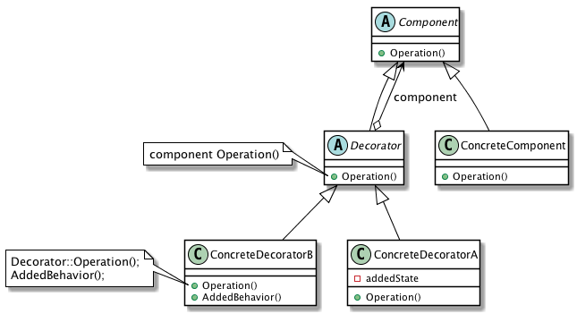

| [Home](Home.md) | [Gallery](Gallery.md) | [Examples](Examples.md) | [Downloads](Downloads.md) | [Documentation](Documentation.md) | [Project](https://sourceforge.net/projects/switchpro) | [Source](https://github.com/gammasoft71/switch) | [License](License.md) | [Gammasoft](https://gammasoft71.wixsite.com/gammasoft) |
|-----------------|-----------------------|-------------------------|-------------------------|-----------------------------------|-------------------------------------------------------|-------------------------------------------------|-----------------------|-----------------------|---------------------------------------------------------|

# Definition

Attach additional responsibilities to an object dynamically. Decorators provide a flexible alternative to subclassing for extending functionality.

Usage          Medium

# UML class diagram



# Sample code

This structural code demonstrates the Decorator pattern which dynamically adds extra functionality to an existing object.

```c++
// Decorator pattern -- Structural example
 
#include <Switch/Switch>
 
using namespace System;
 
namespace DesignPatterns {
  namespace Structural {
    // The 'Component' abstract class
    class Component abstract_ {
    public:
      virtual void Operation() const = 0;
    };
    
    // The 'ConcreteComponent' class
    class ConcreteComponent : public Component {
    public:
      void Operation() const override {Console::WriteLine("ConcreteComponent.Operation()");}
    };
    
    // The 'Decorator' abstract class
    class Decorator : public Component {
    public:
      void SetComponent(refptr<Component> component) {this->component = component;}
      
      void Operation() const override {
        if (component != null) {
          component->Operation();
        }
      }
      
    protected:
      refptr<Component> component;
    };
    
    // The 'ConcreteDecoratorA' class
    class ConcreteDecoratorA : public Decorator {
    public:
      void Operation() const override {
        Decorator::Operation();
        Console::WriteLine("ConcreteDecoratorA.Operation()");
      }
    };
    
    // The 'ConcreteDecoratorB' class
    class ConcreteDecoratorB : public Decorator {
    public:
      void Operation() const override {
        Decorator::Operation();
        AddedBehavior();
        Console::WriteLine("ConcreteDecoratorB.Operation()");
      }
      
      void AddedBehavior() const {}
    };
    
    // MainApp startup class for Structural
    // Decorator Design Pattern.
    class MainApp {
    public:
      // Entry point into console application.
      static void Main() {
        // Create ConcreteComponent and two Decorators
        refptr<ConcreteComponent> c = ref_new<ConcreteComponent>();
        refptr<ConcreteDecoratorA> d1 = ref_new<ConcreteDecoratorA>();
        refptr<ConcreteDecoratorB> d2 = ref_new<ConcreteDecoratorB>();
        
        // Link decorators
        d1->SetComponent(as<Component>(c));
        d2->SetComponent(as<Component>(d1));
        
        d2->Operation();
      }
    };
  }
}
 
// Specify the Main entry point to System
startup_(DesignPatterns::Structural::MainApp);
```

# Output

```
ConcreteComponent.Operation()
ConcreteDecoratorA.Operation()
ConcreteDecoratorB.Operation()
```

# See also
​
Other Resources

* [Framework Design Guidelines](FrameworkDesignGuidelines.md)
* [Common Design Patterns](CommonDesignPatterns.md)

______________________________________________________________________________________________

© 2010 - 2018 by Gammasoft.
