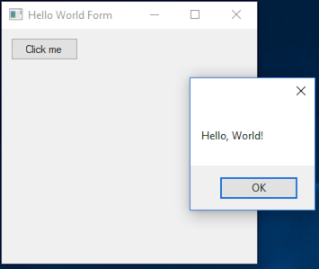
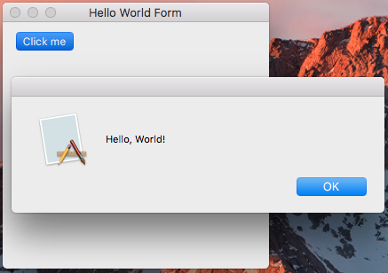
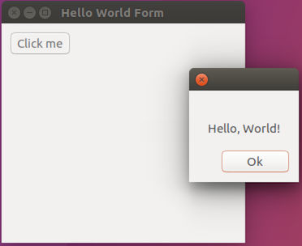

| [Home](Home.md) | [Gallery](Gallery.md) | [Examples](Examples.md) | [Downloads](Downloads.md) | [Documentation](Documentation.md) | [Project](https://sourceforge.net/projects/switchpro) | [Source](https://github.com/gammasoft71/switch) | [License](License.md) | [Contact](Contact.md) | [GAMMA Soft](https://gammasoft71.wixsite.com/gammasoft) |
|-----------------|-----------------------|-------------------------|-------------------------|-----------------------------------|-------------------------------------------------------|-------------------------------------------------|-----------------------|-----------------------|---------------------------------------------------------|

The Classic first ​application "Hello World".

# Console

HelloWorld.cpp:

```c++
#include <Switch/Switch>
​
using namespace System;
​
namespace HelloWorld {
  class Program {
  public:
    static void Main() {
      Console::WriteLine("Hello, World!");
    }
  };
}
​
_startup (HelloWorld::Program)
```

CMakeLists.txt:

```cmake
cmake_minimum_required(VERSION 3.2)
 
Project(HelloWorld)
find_package(Switch REQUIRED)
add_executable(HelloWorld HelloWorld.cpp)
target_link_libraries(HelloWorld Switch.Core)
```

Console output:

```
Hello, World!
```

# Forms

HelloWorldForm.cpp:

```c++
#include <Switch/Switch>
 
using namespace System;
using namespace System::Drawing;
using namespace System::Windows::Forms;
​
namespace HelloWorld {
  class Program {
  public:
    static void Main() {
      Application::EnableVisualStyles();
     
      Button button;
      button.Text = "Click me";
      button.Location = Point(10, 10);
      button.Click += _delegate(const object& sender, const EventArgs& e) {
        MessageBox::Show("Hello, World!");
      };
​
      Form form;
      form.Text = "Hello World Form";
      form.Controls().Add(button);
​
      Application::Run(form);
    }
  };
}
 
_startup (HelloWorld::Program)
```

CMakeLists.txt:

```cmake
cmake_minimum_required(VERSION 3.2)
 
Project(HelloWorldForm)
find_package(Switch REQUIRED)
add_executable(HelloWorldForm ${SWITCH_GUI} HelloWorldForm.cpp)
target_link_libraries(HelloWorldForm Switch.Forms)
```
Running application on Windows:



Running application on macOS:



Running application on Ubuntu:



# TUnit

HelloWorldTest.cpp:

```c++
#include <Switch/Switch>
 
using namespace System;
using namespace TUnit;
 
namespace UnitTests {
  class HelloWorldTest : public TestFixture {
  protected:
    void CreateStringFromLiteral() {
      string s = "Hello, World!";
      Assert::AreEqual("Hello, World!", s);
    }
 
    void CreateStringFromChar32Array() {
      string s = string(Array<char32> {'H', 'e', 'l', 'l', 'o', ',', ' ', 'W', 'o', 'r', 'l', 'd', '!'});
      Assert::AreEqual("Hello, World!", s);
    }
  };
 
  _test (HelloWorldTest, CreateStringFromLiteral)
  _test (HelloWorldTest, CreateStringFromChar32Array)
}
```

CMakeLists.txt:

```cmake
cmake_minimum_required(VERSION 3.2)
​
Project(HelloWorldTest)
find_package(Switch REQUIRED)
add_executable(HelloWorldTest HelloWorldTest.cpp)
target_link_libraries(HelloWorldTest Switch.TUnit.Main)
```
Console output:

```
Start 2 tests from 1 test case
  Start 2 tests from HelloWorldTest
    PASSED HelloWorldTest.CreateStringFromLiteral (0 ms)
    PASSED HelloWorldTest.CreateStringFromChar32Array (0 ms)
  End 2 tests from HelloWorldTest (3 ms total)
 
  Summary :
    PASSED 2 tests.
End 2 tests from 1 test case ran. (4 ms total)
```

[Click here to see more examples](https://github.com/gammasoft71/Switch/tree/master/examples)

______________________________________________________________________________________________

© 2010 - 2017 by GAMMA Soft.
