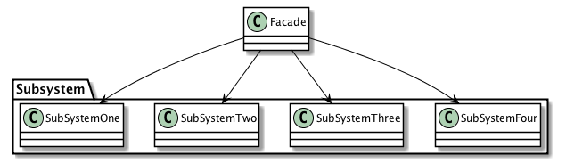

| [Home](Home.md) | [Gallery](Gallery.md) | [Examples](Examples.md) | [Downloads](Downloads.md) | [Documentation](Documentation.md) | [Project](https://sourceforge.net/projects/switchpro) | [Source](https://github.com/gammasoft71/switch) | [License](License.md) | [Contact](Contact.md) | [GAMMA Soft](https://gammasoft71.wixsite.com/gammasoft) |
|-----------------|-----------------------|-------------------------|-------------------------|-----------------------------------|-------------------------------------------------------|-------------------------------------------------|-----------------------|-----------------------|---------------------------------------------------------|

# Definition

Provide a unified interface to a set of interfaces in a subsystem. Façade defines a higher-level interface that makes the subsystem easier to use.

Usage          High

# UML class diagram



# Sample code

This structural code demonstrates the Facade pattern which provides a simplified and uniform interface to a large subsystem of classes.

```c++
// Facade pattern -- Structural example
 
#include <Switch/Switch>
 
using namespace System;
 
namespace DesignPatterns {
  namespace Structural {
    // The 'Subsystem ClassA' class
    class SubSystemOne : public object {
    public:
      void MethodOne() const {Console::WriteLine(" SubSystemOne Method");}
    };
    
    // The 'Subsystem ClassB' class
    class SubSystemTwo : public object {
    public:
      void MethodTwo() const {Console::WriteLine(" SubSystemTwo Method");}
    };
    
    // The 'Subsystem ClassC' class
    class SubSystemThree : public object {
    public:
      void MethodThree() const {Console::WriteLine(" SubSystemThree Method");}
    };
    
    // The 'Subsystem ClassD' class
    class SubSystemFour : public object {
    public:
      void MethodFour() const {Console::WriteLine(" SubSystemFour Method");}
    };
    
    // The 'Facade' class
    class Facade : public object {
    public:
      Facade() {}
      
      void MethodA() const {
        Console::WriteLine("\nMethodA() ---- ");
        this->one.MethodOne();
        this->two.MethodTwo();
        this->four.MethodFour();
      }
      
      void MethodB() const {
        Console::WriteLine("\nMethodB() ---- ");
        this->two.MethodTwo();
        this->three.MethodThree();
      }
 
    private:
      SubSystemOne one;
      SubSystemTwo two;
      SubSystemThree three;
      SubSystemFour four;
    };
    
    // MainApp startup class for Structural
    // Facade Design Pattern.
    class MainApp {
    public:
      // Entry point into console application.
      static void Main() {
        Facade facade;
        
        facade.MethodA();
        facade.MethodB();
      }
    };
  }
}
 
// Specify the Main entry point to System
_startup (DesignPatterns::Structural::MainApp)
```

# Output

```
MethodA() ----
 SubSystemOne Method
 SubSystemTwo Method
 SubSystemFour Method
​
MethodB() ----
 SubSystemTwo Method
 SubSystemThree Method
```

# See also
​
Other Resources

* [Framework Design Guidelines](FrameworkDesignGuidelines.md)
* [Common Design Patterns](CommonDesignPatterns.md)

______________________________________________________________________________________________

© 2010 - 2017 by GAMMA Soft.
