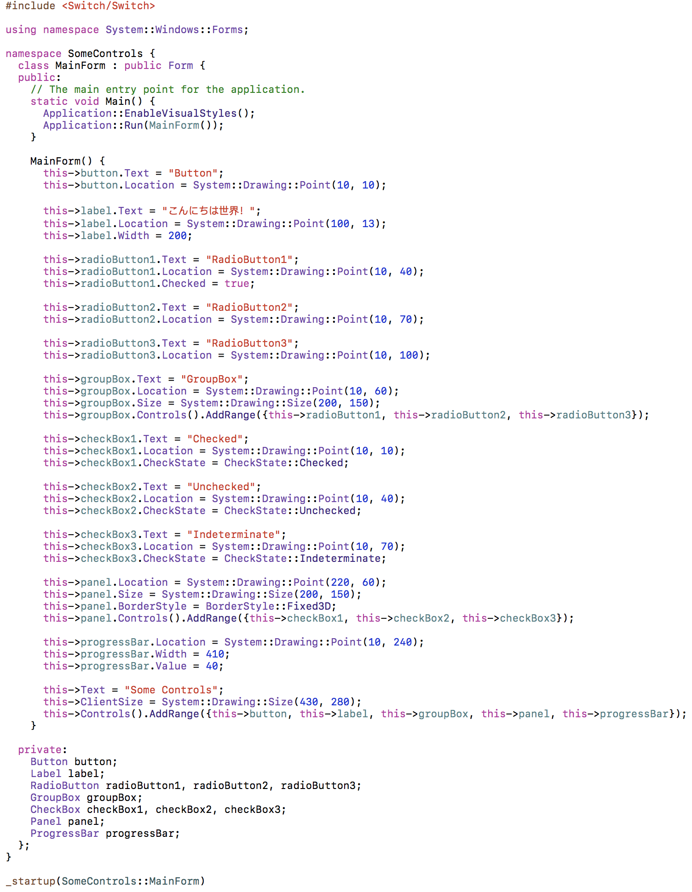

| [Home](Home.md) | [Gallery](Gallery.md) | [Examples](Examples.md) | [Downloads](Downloads.md) | [Documentation](Documentation.md) | [Project](https://sourceforge.net/projects/switchpro) | [Source](https://github.com/gammasoft71/switch) | [License](License.md) | [Gammasoft](https://gammasoft71.wixsite.com/gammasoft) |
|-----------------|-----------------------|-------------------------|-------------------------|-----------------------------------|-------------------------------------------------------|-------------------------------------------------|-----------------------|---------------------------------------------------------|

[SomeControl Code](https://github.com/gammasoft71/Switch/tree/master/Examples/Forms/SomeControls)

[SomeControl Windows](https://github.com/gammasoft71/Switch/tree/master/Examples/Forms/SomeControls)

[SomeControl macOS](https://github.com/gammasoft71/Switch/tree/master/Examples/Forms/SomeControls)

[SomeControl Ubuntu](https://github.com/gammasoft71/Switch/tree/master/Examples/Forms/SomeControls)

[Calculator](https://github.com/gammasoft71/Switch/tree/Release-0.1.0/Examples/Forms/Calculator)

[Sudoku](https://github.com/gammasoft71/Switch/tree/Release-0.1.0/Examples/Forms/Sudoku)

[Switch](https://gammasoft71.wixsite.com/switch)

[Gammasoft](https://gammasoft71.wixsite.com/gammasoft)

______________________________________________________________________________________________

© 2010 - 2018 by Gammasoft.
