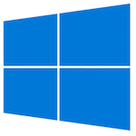
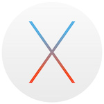
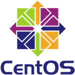
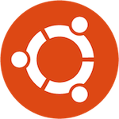

| [Home](Home.md) | [Gallery](Gallery.md) | [Examples](Examples.md) | [Downloads](Downloads.md) | [Documentation](Documentation.md) | [Project](https://sourceforge.net/projects/switchpro) | [Source](https://github.com/gammasoft71/switch) | [License](License.md) | [Contact](Contact.md) | [GAMMA Soft](https://gammasoft71.wixsite.com/gammasoft) |
|-----------------|-----------------------|-------------------------|-------------------------|-----------------------------------|-------------------------------------------------------|-------------------------------------------------|-----------------------|-----------------------|---------------------------------------------------------|

# Operating System

Actualy Switch run on Windows, macOS and linux Operating System.

## Windows 7 or later

## macOS 10.11.5 (OS X El Capitan) or later

## CentOS 7 or later

## Debian 9.2.1 or later

## Elementary OS 0.4 or later

## Fedora 26 or later

## LinuxMint 18.2 or later

## Redhat 7.4 or later

## Ubuntu 16.04 or later

# Native

Switch has a thin layer in each library to abstract operating system. this layer is called naturally **Native**.

For add a new Operating System, you juste have to implement Native api for the new target Operating System.

## Native API by library

[Switch.core](../src/Switch.Core/src/Native/Api.hpp)

______________________________________________________________________________________________

© 2010 - 2017 by GAMMA Soft.
