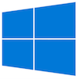
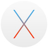

| [Home](Home.md) | [Gallery](Gallery.md) | [Examples](Examples.md) | [Downloads](Downloads.md) | [Documentation](Documentation.md) | [Project](https://sourceforge.net/projects/switchpro) | [Source](https://github.com/gammasoft71/switch) | [License](License.md) | [Gammasoft](https://gammasoft71.wixsite.com/gammasoft) |
|-----------------|-----------------------|-------------------------|-------------------------|-----------------------------------|-------------------------------------------------------|-------------------------------------------------|-----------------------|---------------------------------------------------------|

The Portability section provide informations about Operating System suported, Compilers and Development Environment tools.

# Operating System Supported

Actualy Switch run on Windows, macOS and Linux Operating System.

## Windows 7 - 32 and 64 bits or later

## macOS 10.11.5 (OS X El Capitan) or later

## Linux - 32 and 64 bits

### CentOS 7 or later

### Debian 9.2.1 or later

### Elementary OS 0.4 or later

### Fedora 26 or later

### LinuxMint 18.2 or later

### Redhat 7.4 or later

### Ubuntu 16.04 or later

## Other distribution (manually installation)

# Tests and coverage

Switch is every time tested with Continuous Integration tools.

## AppVeyor

Configurations :

* Visual Studio 2017 Win32
* Visual Studio 2017 Win64

## Travis CI

Configurations :
* macOS Xcode 9.1
* linux clang 3.9
* Reference Guide generation

## Codecov

# Development Environment Tools

With CMake, Switch support many Development Environment Tools.

## Microsoft Visual C++ 2015 or later

## XCode 8.3 or later

## CLion 2017.2 or later

## Eclipse CDT 8.0 or later

## Code::Blocks 13.12 or later

## KDevelop 3 or later

## CodeLite 11 or later

## Qt Creator

## Standard Unix makefile

# Compilers

The compilers listed below are supported with Switch :

* MSVC 2015 or later
* clang 3.9 or later 
<!--* GCC 6 or later-->

# Native

Switch has a thin layer by library if needed to abstract operating system. This layer is called naturally **Native**.

For add a new Operating System, you juste have to implement Native api for the new target Operating System.

## Native API by library

[Switch.Core](../src/Switch.Core/src/Native/Api.hpp)

[Switch.System](../src/Switch.System/src/Native/Api.hpp)

[Switch.System.Drawing](../src/Switch.System.Drawing/src/Native/Api.hpp)

[Switch.System.Windows.Forms](../src/Switch.System.Windows.Forms/src/Native/Api.hpp)

______________________________________________________________________________________________

© 2010 - 2018 by Gammasoft.
