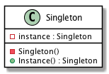

| [Home](Home.md) | [Gallery](Gallery.md) | [Examples](Examples.md) | [Downloads](Downloads.md) | [Documentation](Documentation.md) | [Project](https://sourceforge.net/projects/switchpro) | [Source](https://github.com/gammasoft71/switch) | [License](License.md) | [Gammasoft](https://gammasoft71.wixsite.com/gammasoft) |
|-----------------|-----------------------|-------------------------|-------------------------|-----------------------------------|-------------------------------------------------------|-------------------------------------------------|-----------------------|---------------------------------------------------------|

# Definition

Ensure a class has only one instance and provide a global point of access to it.

Usage          Medium high

# UML class diagram



# Sample code

This structural code demonstrates the Singleton pattern which assures only a single instance (the singleton) of the class can be created.

```c++
// Singleton pattern -- Creational example
 
#include <Switch/Switch>
 
using namespace System;
 
namespace DesignPatterns {
  namespace Creational {
    // The 'Singleton' class
    class Singleton : public object {
    public:
      static Singleton& Instance() {return instance;}
 
    protected:
      // Constructor is 'protected'
      Singleton() {}
      Singleton(const Singleton&) = delete;
      Singleton& operator =(const Singleton&) = delete;
      
    private:
      static Singleton instance;
    };
 
    Singleton Singleton::instance;
    
    // MainApp startup class for Creational
    // Singleton Design Pattern.
    class MainApp {
    public:
      // Entry point into console application.
      static void Main() {
        // Constructor is protected -- cannot use constructor
        ref<Singleton> singleton1 = Singleton::Instance();
        ref<Singleton> singleton2 = Singleton::Instance();
 
        // Test for same instance
        if (&singleton1 == &singleton2)
          Console::WriteLine("Objects are the same instance");
      }
    };
  }
}
 
// Specify the Main entry point to System
startup_(DesignPatterns::Creational::MainApp);
```

# Output

```
Objects are the same instance
```

# See also
​
Other Resources

* [Framework Design Guidelines](FrameworkDesignGuidelines.md)
* [Common Design Patterns](CommonDesignPatterns.md)

______________________________________________________________________________________________

© 2010 - 2018 by Gammasoft.
