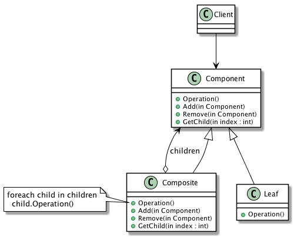

# Composite

## Definition
Compose objects into tree structures to represent part-whole hierarchies. Composite lets clients treat individual objects and compositions of objects uniformly.
 

Usage          Medium high

## UML class diagram

