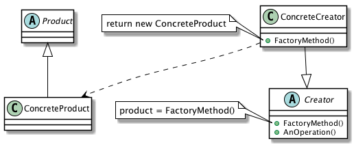

# FactoryMethod

## Definition
Define an interface for creating an object, but let subclasses decide which class to instantiate. Factory Method lets a class defer instantiation to subclasses.
 

## UML class diagram

